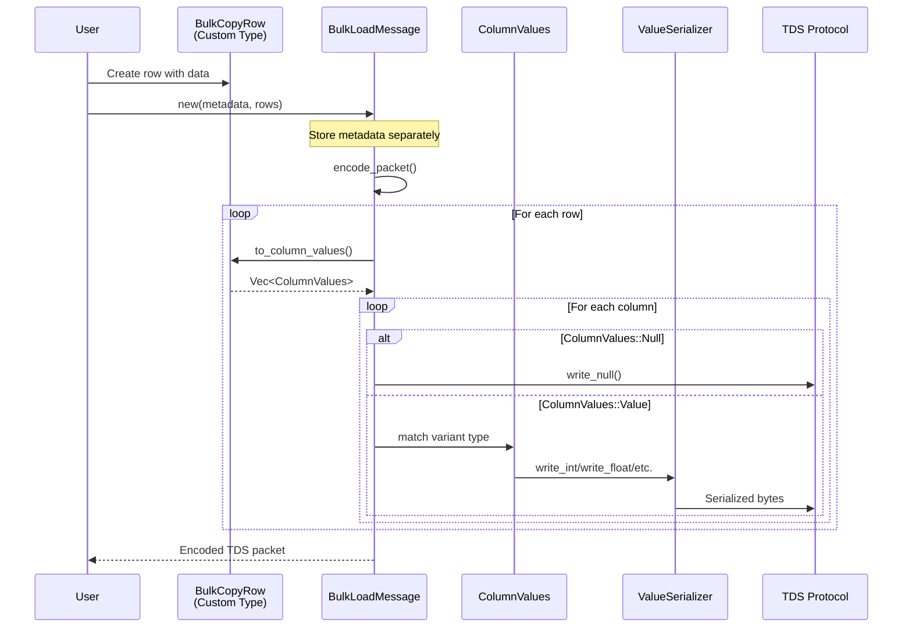
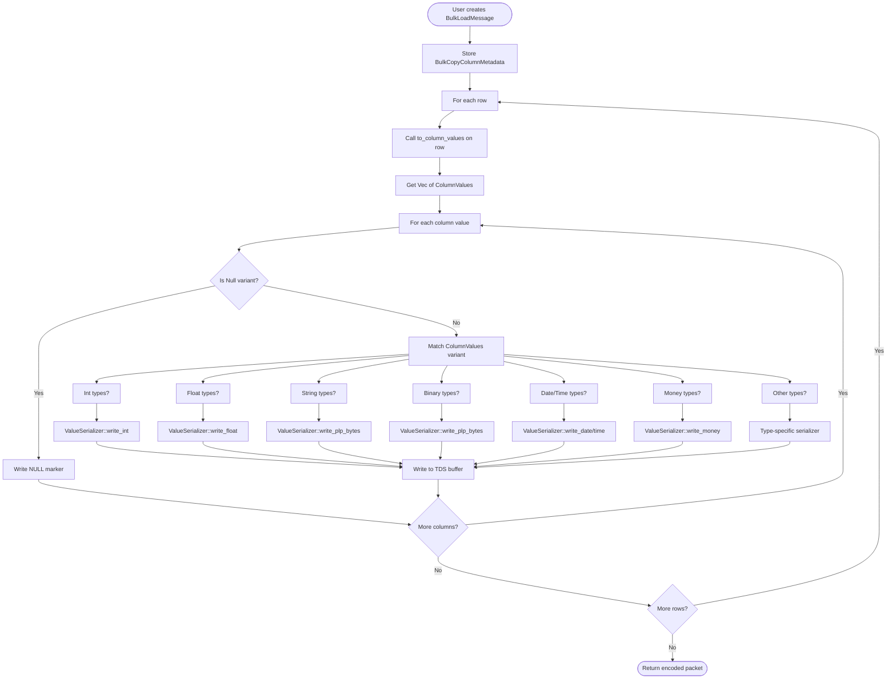
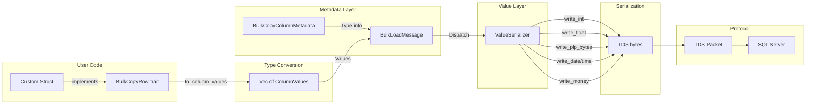

# Bulk Copy Type System Analysis

This document provides a comprehensive analysis of the bulk copy type system implementation in mssql-tds, including architectural diagrams and a comparison with the RPC parameter type system (SqlType).

## Table of Contents

1. [Overview](#overview)
2. [Sequence Diagram: Bulk Copy Flow](#sequence-diagram-bulk-copy-flow)
3. [Flow Chart: Type Resolution in Bulk Copy](#flow-chart-type-resolution-in-bulk-copy)
4. [Data Flow Diagram](#data-flow-diagram)
5. [Type System Comparison](#type-system-comparison)
6. [Code Pointers](#code-pointers)
7. [Can We Reuse SqlType for Bulk Copy?](#can-we-reuse-sqltype-for-bulk-copy)

## Overview

The bulk copy implementation uses a separate type system (`ColumnValues` enum) from the RPC parameter system (`SqlType` enum). Both systems serialize values to the TDS protocol format, but they differ in how they handle metadata and NULL values.

### Key Components

- **ColumnValues enum**: Represents bulk copy data values with a separate `Null` variant
- **BulkCopyColumnMetadata**: Describes column metadata (type, size, precision, scale)
- **BulkLoadMessage**: TDS protocol message for bulk insert operations
- **ValueSerializer**: Shared serialization functions used by both systems

## Sequence Diagram: Bulk Copy Flow



### Key Observations

1. **Metadata Separation**: `BulkCopyColumnMetadata` is provided once at message creation time
2. **Row Conversion**: Each row is converted to `Vec<ColumnValues>` via `to_column_values()` trait method
3. **Type-based Dispatch**: Each `ColumnValues` variant dispatches to appropriate `ValueSerializer` function
4. **NULL Handling**: NULL values are represented by `ColumnValues::Null` variant

## Flow Chart: Type Resolution in Bulk Copy



## Data Flow Diagram



### Data Flow Explanation

1. **User Code**: Custom structs implement `BulkCopyRow` trait
2. **Type Conversion**: `to_column_values()` converts struct fields to `ColumnValues` enum
3. **Metadata Layer**: Column metadata describes types, passed to `BulkLoadMessage`
4. **Value Layer**: Column values flow through `BulkLoadMessage`, dispatched to `ValueSerializer`
5. **Serialization**: `ValueSerializer` functions write TDS-formatted bytes
6. **Protocol**: Bytes assembled into TDS packet sent to SQL Server

## Type System Comparison

### SqlType (RPC Parameters)

**Location**: `mssql-tds/src/sqltypes.rs`

**Pattern**:
```rust
pub enum SqlType {
    Bit(Option<bool>),
    Int(Option<i32>),
    NVarchar(Option<String>, u16),  // value + max_length
    DateTime2(Option<NaiveDateTime>, u8),  // value + scale
    // ... more variants
}
```

**NULL Handling**: Uses `Option<T>` - type-safe NULL representation

**Metadata**: Embedded in enum variants (e.g., max_length, scale)

**Serialization**: Single `serialize()` method with context parameter:
```rust
fn serialize(&self, encoder: &mut Encoder, db_collation: Option<&Collation>) -> Result<()>
```

### ColumnValues (Bulk Copy)

**Location**: `mssql-tds/src/bulk_copy/column_values.rs`

**Pattern**:
```rust
pub enum ColumnValues {
    Null,
    Bit(bool),
    Int(i32),
    NVarchar(String),
    DateTime2(NaiveDateTime),
    // ... more variants
}
```

**NULL Handling**: Separate `Null` variant - requires additional match branch

**Metadata**: Separate `BulkCopyColumnMetadata` structure

**Serialization**: Pattern matching in `BulkLoadMessage::write_value()`:
```rust
match value {
    ColumnValues::Null => write_null(),
    ColumnValues::Int(v) => ValueSerializer::write_int(...),
    // ... more variants
}
```

### Key Differences

| Aspect | SqlType | ColumnValues |
|--------|---------|--------------|
| NULL handling | `Option<T>` (type-safe) | Separate `Null` variant |
| Metadata | Embedded in variants | Separate `BulkCopyColumnMetadata` |
| Type safety | Prevents invalid NULL states | Allows mixing NULL with any type |
| Serialization | Single method with context | Match pattern in caller |
| Code location | sqltypes.rs | column_values.rs |
| Usage | RPC parameters | Bulk copy only |

## Code Pointers

### ColumnValues Definition
- **File**: `mssql-tds/src/bulk_copy/column_values.rs`
- **Lines**: 1-150 (enum definition)
- **Key variants**: `Null`, `Bit`, `TinyInt`, `SmallInt`, `Int`, `BigInt`, `Float`, `NVarchar`, `DateTime2`, etc.

### BulkCopyColumnMetadata
- **File**: `mssql-tds/src/bulk_copy/metadata.rs`
- **Lines**: 10-50 (struct definition)
- **Fields**: `column_type`, `precision`, `scale`, `max_length`, `collation`

### BulkCopyRow Trait
- **File**: `mssql-tds/src/bulk_copy.rs`
- **Lines**: 60-100 (trait definition)
- **Key method**: `to_column_values(&self) -> Vec<ColumnValues>`

### BulkLoadMessage
- **File**: `mssql-tds/src/bulk_load.rs`
- **Lines**: 100-800 (implementation)
- **Key methods**: 
  - `new()` (lines 150-200): Creates message with metadata
  - `write_value()` (lines 470-600): Dispatches to ValueSerializer
  - `write_null()` (lines 700-750): Writes NULL marker
  - `write_type_info()` (lines 240-400): Writes column metadata

### ValueSerializer
- **File**: `mssql-tds/src/value_serializer.rs`
- **Lines**: 1-600 (shared serialization functions)
- **Key functions**:
  - `write_int()` (lines 50-100): Integer serialization
  - `write_float()` (lines 120-150): Float serialization
  - `write_decimal()` (lines 170-250): Decimal/numeric serialization
  - `write_date()` (lines 300-350): Date serialization
  - `write_time()` (lines 360-420): Time serialization
  - `write_money()` (lines 450-500): Money serialization
  - `write_plp_bytes()` (lines 520-580): PLP (varchar, varbinary) serialization

### SqlType Serialization
- **File**: `mssql-tds/src/sqltypes.rs`
- **Lines**: 200-1200 (serialize method and helpers)
- **Key methods**:
  - `serialize()` (lines 200-250): Main serialization dispatch
  - `serialize_bit()` (lines 260-280): Bit type
  - `serialize_int()` (lines 300-350): Integer types
  - `serialize_datetime2()` (lines 600-650): DateTime2 type
  - `serialize_money()` (lines 800-850): Money types

## Can We Reuse SqlType for Bulk Copy?

### Question

Why do we need a separate `BulkCopyType` enum (or the current `ColumnValues` enum) when `SqlType` already exists? Can we reuse `SqlType` for bulk copy operations?

### Answer: Yes, We Can and Should Reuse SqlType

After analyzing both type systems, **SqlType can and should be reused for bulk copy operations**. Here's why:

#### 1. SqlType Already Has All Necessary Features

**Metadata Support**: SqlType variants already embed the metadata needed for serialization:
```rust
// SqlType already has metadata
NVarchar(Option<String>, u16)  // max_length embedded
DateTime2(Option<NaiveDateTime>, u8)  // scale embedded
Decimal(Option<BigDecimal>, u8, u8)  // precision, scale embedded
```

**External Metadata**: For metadata not in variants (like collation), SqlType's `serialize()` method already accepts external parameters:
```rust
fn serialize(&self, encoder: &mut Encoder, db_collation: Option<&Collation>) -> Result<()>
```

**Type-Safe NULL Handling**: SqlType uses `Option<T>`, which is more type-safe than `ColumnValues::Null`:
```rust
// SqlType - compiler prevents invalid states
Int(None)  // Valid NULL
Int(Some(42))  // Valid non-NULL

// ColumnValues - runtime checks needed
Null  // Could be meant for any type
Int(42)  // No way to represent NULL for specific int
```

#### 2. Comparison of Current vs. Ideal Approach

| Aspect | Current (ColumnValues) | Ideal (SqlType) |
|--------|------------------------|-----------------|
| Type enum | Separate `ColumnValues` | Reuse `SqlType` |
| Metadata | Separate `BulkCopyColumnMetadata` | Embedded + external params |
| NULL handling | `Null` variant | `Option<T>` |
| Trait method | `to_column_values()` | `to_sql_types()` |
| Serialization | Match in `BulkLoadMessage` | `SqlType::serialize()` with context |
| Code duplication | Parallel type system | Single unified system |
| Type safety | Runtime checks for NULL/type mismatch | Compile-time NULL safety |

#### 3. How SqlType Can Work for Bulk Copy

The key insight is that SqlType's `serialize()` method can be made context-aware:

**Current SqlType serialization**:
```rust
impl SqlType {
    pub fn serialize(&self, encoder: &mut Encoder, db_collation: Option<&Collation>) -> Result<()> {
        // Writes metadata + value (for RPC)
        match self {
            SqlType::Int(Some(v)) => {
                encoder.write_type_info(...);  // metadata
                ValueSerializer::write_int(encoder, *v)?;  // value
            }
            SqlType::Int(None) => {
                encoder.write_type_info(...);  // metadata
                encoder.write_null()?;  // NULL marker
            }
            // ... more variants
        }
    }
}
```

**Enhanced SqlType serialization with context**:
```rust
pub enum SerializationContext {
    RpcParameter,
    BulkCopy,
}

impl SqlType {
    pub fn serialize(&self, encoder: &mut Encoder, db_collation: Option<&Collation>, 
                     context: SerializationContext) -> Result<()> {
        match context {
            SerializationContext::RpcParameter => {
                // Write metadata + value (current behavior)
                self.write_metadata(encoder, db_collation)?;
                self.write_value(encoder)?;
            }
            SerializationContext::BulkCopy => {
                // Write only value (metadata already in column definition)
                self.write_value(encoder)?;
            }
        }
    }
}
```

#### 4. Migration Path

**Phase 1: Add context to SqlType::serialize()**
```rust
// Add context parameter
fn serialize(&self, encoder: &mut Encoder, db_collation: Option<&Collation>, 
             context: SerializationContext) -> Result<()>

// Update all RPC call sites
sql_type.serialize(encoder, collation, SerializationContext::RpcParameter)?;
```

**Phase 2: Add to_sql_types() to BulkCopyRow trait**
```rust
pub trait BulkCopyRow {
    fn to_sql_types(&self) -> Vec<SqlType>;  // New method
    fn to_column_values(&self) -> Vec<ColumnValues>;  // Deprecated
}
```

**Phase 3: Update BulkLoadMessage to accept SqlType**
```rust
impl BulkLoadMessage {
    pub fn new(metadata: Vec<BulkCopyColumnMetadata>, rows: Vec<Vec<SqlType>>) -> Self {
        // metadata used only for column definition section
        // rows serialized with SqlType::serialize(context = BulkCopy)
    }
}
```

**Phase 4: Deprecate ColumnValues**
```rust
#[deprecated(since = "0.x.0", note = "Use SqlType instead")]
pub enum ColumnValues { ... }
```

#### 5. Benefits of Using SqlType

1. **Eliminate Code Duplication**: Single type system for both RPC and bulk copy
2. **Type Safety**: Compile-time NULL checking with `Option<T>`
3. **Consistency**: Same type representation across all TDS operations
4. **Maintainability**: Changes to types only need updates in one place
5. **Reduced Complexity**: Fewer enum definitions, fewer conversion traits
6. **Better API**: Users already familiar with SqlType from RPC don't learn new types

#### 6. Why the Separation Existed

The current separation likely arose from:
1. **Different metadata handling**: RPC sends metadata with each parameter, bulk copy sends once
2. **Different NULL representation**: RPC uses type info + NULL marker, bulk copy uses length-based NULL
3. **Historical development**: Bulk copy implemented separately before refactoring opportunity identified
4. **.NET API influence**: Following `SqlBulkCopy` patterns which differ from `SqlParameter`

However, these differences can be handled by context-aware serialization in a unified type system.

### Recommendation

**Do NOT create a separate BulkCopyType enum.** Instead:
1. Enhance SqlType with context-aware serialization
2. Update BulkCopyRow trait to use `to_sql_types()` instead of `to_column_values()`
3. Gradually deprecate ColumnValues enum
4. Benefit from a unified, type-safe TDS type system

This approach provides better type safety, reduces code duplication, and creates a more maintainable codebase.
