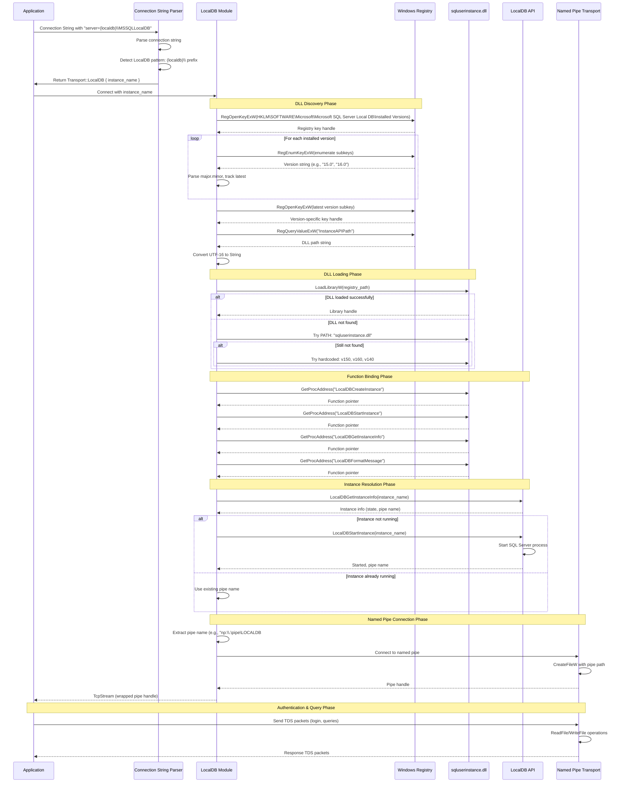

# LocalDB Connection Flow

This diagram shows the complete sequence of operations when establishing a LocalDB connection.

## Key Phases

### 1. Connection String Parsing
- Detects `(localdb)\` prefix pattern
- Extracts instance name (e.g., `MSSQLLocalDB`)
- Returns `Transport::LocalDB` variant

### 2. DLL Discovery (Registry-Based)
- Queries Windows Registry: `HKLM\SOFTWARE\Microsoft\Microsoft SQL Server Local DB\Installed Versions`
- Enumerates all installed versions (15.0, 16.0, 17.0, etc.)
- Selects latest version by comparing major.minor numbers
- Reads `InstanceAPIPath` value to get DLL location
- **Fallback**: PATH → Hardcoded paths (v150, v160, v140)

### 3. Function Binding
Loads 4 essential LocalDB API functions:
- `LocalDBCreateInstance` - Create new instances
- `LocalDBStartInstance` - Start stopped instances
- `LocalDBGetInstanceInfo` - Get instance state and pipe name
- `LocalDBFormatMessage` - Format error messages

### 4. Instance Resolution
- Calls `LocalDBGetInstanceInfo` to check instance state
- If not running: calls `LocalDBStartInstance` to launch SQL Server process
- Retrieves named pipe path from instance info

### 5. Named Pipe Connection
- Extracts pipe path (e.g., `\\.\pipe\LOCALDB#62AFEA01\tsql\query`)
- Uses Windows `CreateFileW` to connect to pipe
- Wraps pipe handle as `TcpStream` for compatibility

### 6. Data Transfer
- All TDS protocol communication happens over the named pipe
- Uses standard `ReadFile`/`WriteFile` Windows APIs

## Important Notes

- **LocalDB is essentially a named pipe with automatic instance management**
- The LocalDB API's main job is to:
  1. Resolve instance name → pipe path
  2. Ensure the instance is running
  3. Return the pipe path for connection
- All actual database communication uses standard named pipe I/O
- The implementation is **ODBC-compatible** (uses same registry discovery)
