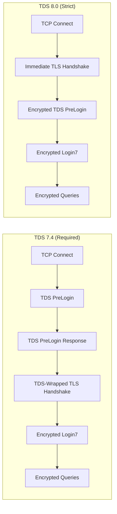
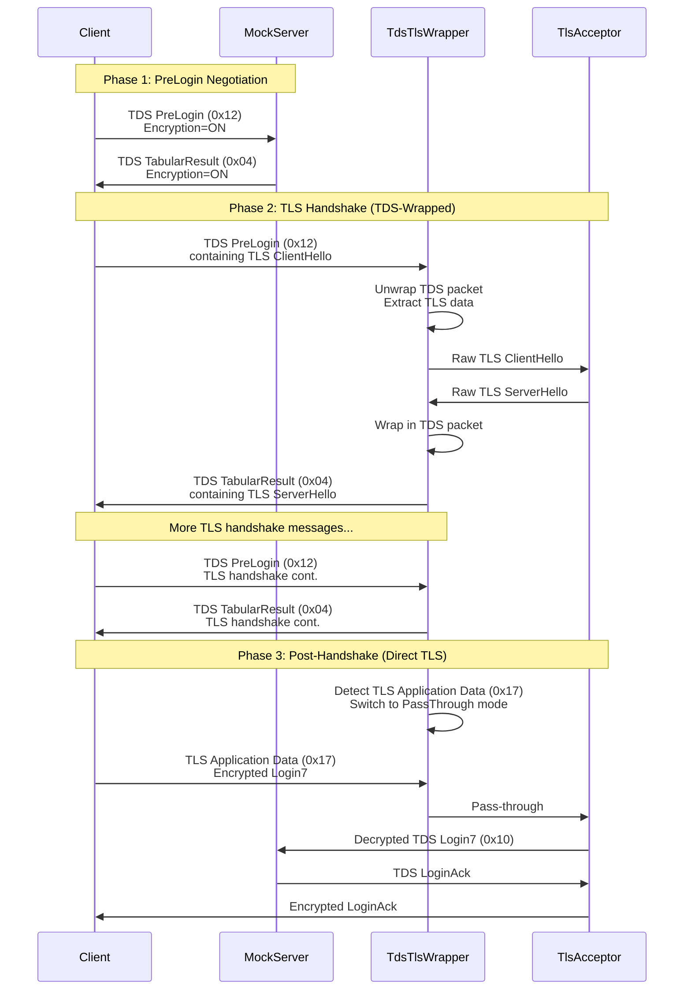
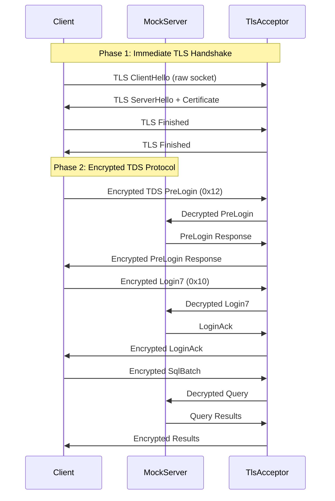
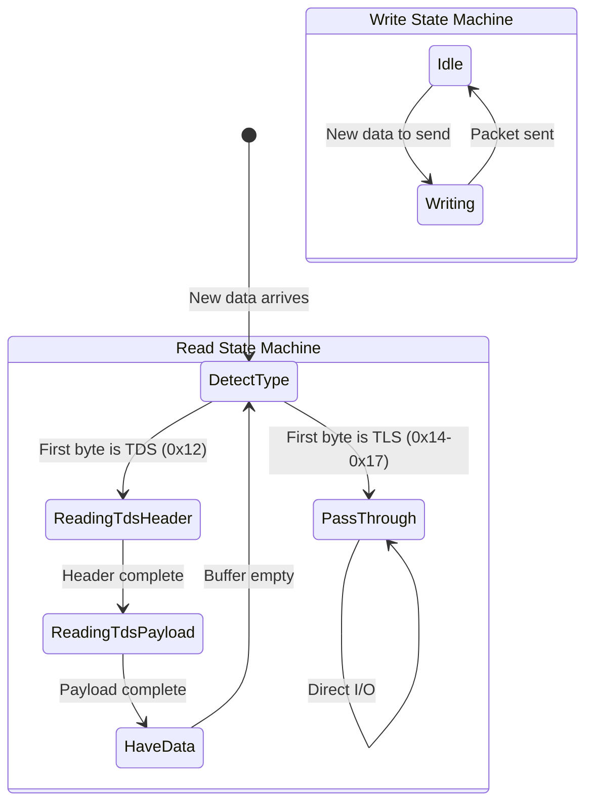
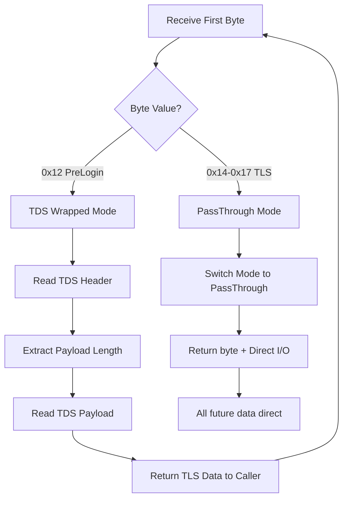
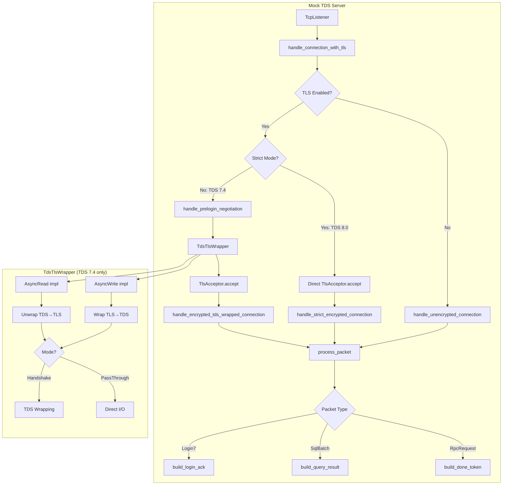
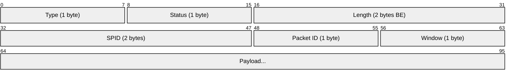

# TDS-TLS Wrapper Architecture

This document explains the architecture of the TDS-TLS wrapper implementation in the mock TDS server, which enables TLS support for both TDS 7.4 (Required) and TDS 8.0 (Strict) encryption modes.

## Overview

SQL Server supports two TLS modes:
- **TDS 7.4 (Required)**: TLS handshake data is wrapped inside TDS PreLogin packets during negotiation
- **TDS 8.0 (Strict)**: TLS handshake happens immediately on the raw TCP socket before any TDS packets

## Encryption Mode Comparison



## Connection Flow Diagram

### TDS 7.4 Required Mode (TDS-Wrapped TLS Handshake)



### TDS 8.0 Strict Mode (Immediate TLS)



## TdsTlsWrapper State Machine



## Packet Type Detection



## Component Architecture



## TDS Packet Structure



## Key Design Decisions

### 1. Encryption Mode Detection
The server uses first-byte detection to distinguish between modes:
```
First byte = 0x12 (TDS PreLogin) → TDS 7.4 Required mode
First byte = 0x16 (TLS Handshake) → TDS 8.0 Strict mode (if strict_mode=true)
```

### 2. Mode Switching (TDS 7.4 only)
The TdsTlsWrapper operates in two modes:
- **Handshake Mode**: During TLS negotiation, TLS data is wrapped in TDS packets
- **PassThrough Mode**: After detecting raw TLS Application Data (0x17), all I/O passes directly

### 3. First-Byte Detection for Mode Switching
```
0x12 = TDS PreLogin → Continue in Handshake mode
0x14 = TLS ChangeCipherSpec → Switch to PassThrough
0x15 = TLS Alert → Switch to PassThrough  
0x16 = TLS Handshake → Switch to PassThrough
0x17 = TLS Application Data → Switch to PassThrough
```

### 4. Packet Wrapping (TDS 7.4 only)
- **Read (Client→Server)**: Unwrap TDS PreLogin (0x12) to extract TLS data
- **Write (Server→Client)**: Wrap TLS data in TDS TabularResult (0x04)

### 5. TDS 8.0 Strict Mode
- TLS handshake happens immediately on raw TCP socket
- No TdsTlsWrapper needed - TlsAcceptor works directly on TcpStream
- All TDS packets (PreLogin, Login7, SqlBatch) flow over encrypted channel

## Files Changed

| File | Purpose |
|------|---------|
| `tds_tls_wrapper.rs` | New: AsyncRead/AsyncWrite wrapper for TDS↔TLS translation (TDS 7.4) |
| `tls_helper.rs` | New: Utilities for creating TLS identities from PEM certificates |
| `server.rs` | Modified: Added TLS support with both TDS 7.4 and TDS 8.0 modes |
| `protocol.rs` | Modified: Added encryption flag to PreLogin response builder |
| `lib.rs` | Modified: Export new modules |
| `Cargo.toml` | Modified: Added TLS dependencies (native-tls, tokio-native-tls, openssl) |

## API Usage

### TDS 7.4 Required Mode
```rust
let identity = create_test_identity(&cert_pem, &key_pem)?;
let server = MockTdsServer::new_with_tls("127.0.0.1:0", Some(identity)).await?;
// Client connects with EncryptionSetting::Required
```

### TDS 8.0 Strict Mode
```rust
let identity = create_test_identity(&cert_pem, &key_pem)?;
let server = MockTdsServer::new_with_strict_tls("127.0.0.1:0", identity).await?;
// Client connects with EncryptionSetting::Strict
```
