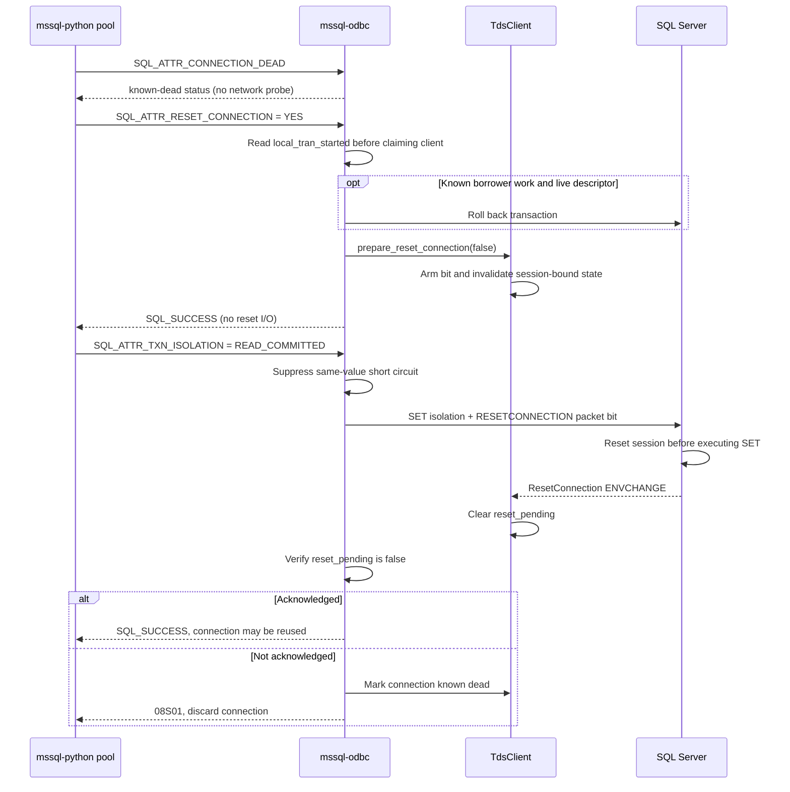

# Design: ODBC Connection-Pool Reuse (ADO #47317)

## Purpose

`mssql-python` owns the client-side connection pool. `mssql-odbc` does not add a
second pool; it supplies the reset, liveness, transaction, and isolation
semantics that let the existing pool safely reuse one physical TDS connection
for multiple borrowers.

This document describes the implemented design. The companion
[`odbc-connection-pooling-python-e2e.md`](./odbc-connection-pooling-python-e2e.md)
describes integration verification.

## Consumer flow

`mssql-python` performs these operations around a pooled connection:

1. On return, roll back borrower work when autocommit is disabled.
2. On acquire, read `SQL_ATTR_CONNECTION_DEAD`; discard the connection only
   when it is known dead.
3. Call `SQLSetConnectAttr(SQL_ATTR_RESET_CONNECTION,
   SQL_RESET_CONNECTION_YES)`.
4. Reapply `SQL_ATTR_TXN_ISOLATION = SQL_TXN_READ_COMMITTED`. SQL Server reset
   does not restore transaction isolation, so this is required on every
   checkout ([mssql-python #343](https://github.com/microsoft/mssql-python/pull/343)).
5. Apply the requested autocommit mode and serve the borrower.

The reset call in step 3 only arms the TDS reset bit. The isolation call in
step 4 carries that bit and verifies the server acknowledgement, so there is no
dedicated reset round trip.

## State model

The similar reset flags belong to different layers:

| State | Owner | Meaning | Cleared when |
|---|---|---|---|
| `pending_reset` | TDS transport | One-shot `RESETCONNECTION` or `RESETCONNECTIONSKIPTRAN` bit for the next eligible packet | The packet writer consumes it |
| `reset_pending` | `TdsClient` | A reset was armed but no `ResetConnection` ENVCHANGE has confirmed it | ENVCHANGE arrives, or a successful reconnect creates a clean session |
| `pending_reset_ack` | ODBC DBC | Checkout must emit a carrying request and verify its acknowledgement | The isolation handler completes or fails |
| `local_tran_started` | ODBC DBC | The application executed work in a manual-commit transaction | Commit, rollback, disconnect, or pool reset |
| `transaction_descriptor` | TDS execution context | SQL Server has an active transaction, including an empty driver-begun transaction | Commit, rollback, full reset, or reconnect |
| `known_dead` | TDS transport | I/O, close, fatal server error, or reset failure proved the connection unusable | A new transport is created |

`local_tran_started` and `transaction_descriptor != 0` are deliberately not
equivalent. Manual-commit setup may begin an empty transaction before the
application executes any work.

## Reset and checkout sequence

The DBC mutex is never held across network I/O. Transaction state is read
before `claim_dbc_client`, and the mutex is not acquired again until the client
is released. Otherwise, a poisoned lock could drop the claimed client and
strand the DBC as `Connected` with no client to serve future requests.

## Arm-time and acknowledgement-time invalidation

`prepare_reset_connection` invalidates client state immediately:

- managed prepared-statement handles;
- cached Always Encrypted parameter metadata;
- pending `sp_prepexec` capture state;
- accumulated session-recovery state;
- current database, language, and collation, restored to login defaults;
- the transaction descriptor for a full reset.

Arm-time invalidation prevents the carrying request from using an object that
the request's own reset bit will invalidate on the server. For example, sending
a cached prepared handle with the reset bit would make SQL Server drop that
handle before executing it.

`on_reset_connection_ack` repeats the cache and settings transition
intentionally. Arm time closes the stale-state window; acknowledgement time is
the shared protocol transition used by every token-processing path and
reconciles the client with the confirmed server reset.

Server-owned state such as temp tables and SET options is reset by SQL Server
before it executes the carrying request.

## Open cursors at check-in

The reset sweeps open cursors before claiming the connection, matching the five
other connection-scoped operations and `claim_dbc_client`'s stated precondition.
An application that closes its connection without closing a cursor is the
ordinary check-in case; rejecting it would make that connection non-poolable and
force the pool to discard a recyclable connection. msodbcsql reaches the same
outcome by a different route — its reset runs on an internal driver statement and
never contends with user cursors — but with a single `TdsClient` and no MARS,
sweeping is how this driver gets there. A connection that is busy for a reason the
sweep cannot clear is still rejected.

## Transaction behavior

Pool reuse always requests a full `RESETCONNECTION`; transactions must not cross
borrowers.

| Mode | TDS packet bit | Transaction descriptor at arm time | Intended caller |
|---|---|---|---|
| Full reset | `RESETCONNECTION` (`0x08`) | Cleared | ODBC connection pool |
| Preserve transaction | `RESETCONNECTIONSKIPTRAN` (`0x10`) | Preserved | Low-level TDS caller with a transaction that must survive |

Clearing the descriptor for a full reset is required before the carrying
request is constructed. Otherwise an empty driver-begun transaction creates
this failure:

1. `local_tran_started == false`, but `transaction_descriptor != 0`.
2. Reset skips the explicit rollback because there is no borrower work.
3. Checkout sees the stale descriptor and sends a rollback carrying the reset
   bit.
4. SQL Server processes the reset first and discards the transaction.
5. SQL Server then processes the rollback and returns error 3903 because no
   transaction remains.

`RESETCONNECTIONSKIPTRAN` must keep the descriptor because its purpose is to
preserve that transaction.

The explicit pre-reset rollback is defense in depth. It closes known borrower
work before reuse and makes rollback failure observable during pool reset; a
failure marks the connection dead instead of relying on a later reset to clean
an uncertain session.

## Why the reset is piggybacked

An earlier implementation sent `SELECT 1` solely to carry and acknowledge the
reset. On loopback, 300 release-build iterations measured:

| Design | Reset plus first query |
|---|---:|
| Dedicated reset round trip | 1.63-1.71 ms |
| Piggyback on checkout isolation SET | 0.79-0.83 ms |

The difference is a complete request/response and therefore grows with network
latency. Piggybacking preserves both properties the eager request provided:

- **Cache safety:** session-bound client state is invalidated when reset is
  armed.
- **Fail at checkout:** `pending_reset_ack` prevents the isolation SET from
  short-circuiting, and the handler checks `reset_pending` after the request.

A consumer that does not issue the checkout isolation SET remains safe: the
reset bit rides its first eligible request and SQL Server resets before
executing it. Such a consumer loses early failure detection, not state
correctness.

## Isolation semantics

`sp_reset_connection` does not restore transaction isolation. The checkout
`SET TRANSACTION ISOLATION LEVEL READ COMMITTED` is therefore both:

1. the reset carrier; and
2. the operation that restores isolation for the next borrower.

`DbcState::txn_isolation` tracks only changes made through the ODBC attribute.
Raw T-SQL can make `SQLGetConnectAttr(SQL_ATTR_TXN_ISOLATION)` report a stale
cached value. That reporting limitation remains.

The cross-borrower leak does not remain. While a reset is pending, the
same-value optimization is disabled, so the checkout SET reaches SQL Server
even when the previous borrower changed isolation through raw T-SQL.

## Liveness semantics

`SQL_ATTR_CONNECTION_DEAD` is a cached read and never probes the socket:

- `SQL_CD_TRUE` means the connection is known dead.
- `SQL_CD_FALSE` means it has not been observed dead; it is not proof of health.
- A disconnected or never-connected DBC reports `SQL_CD_TRUE`.
- A connected DBC whose client is temporarily absent because another operation
  claimed it reports `SQL_CD_FALSE`, not dead.

The transport becomes known dead after explicit close, observed I/O failure,
EOF, a fatal server error token (severity at least 20), or an unrecoverable
pool-reset failure.

## Reset attribute identifiers

The driver accepts both identifiers:

| Identifier | Value | Used by |
|---|---:|---|
| `SQL_ATTR_RESET_CONNECTION` | 116 | `mssql-python`, which loads and calls the driver directly; unixODBC DM callers |
| `SQL_COPT_SS_RESET_CONNECTION` | 1246 | Driver-Manager-mediated Windows callers |

Windows Driver Manager reserves attribute 116 for DM-to-driver communication
and rejects an application setting it directly with `HY092`. Advertising ODBC
3.8 does not change that rule. `mssql-python` bypasses the Driver Manager, so
116 reaches this driver on every platform.

The reset handler accepts only `SQL_RESET_CONNECTION_YES`; other values produce
`HY024`. Reset on a disconnected DBC produces `08003`, and a busy connection is
rejected rather than disturbing another statement's stream.

## Recovery and authentication

Reset reuses the existing physical login and does not repeat LOGIN7, federated
authentication, or access-token exchange. Rotated credentials require a new
physical connection.

If session recovery reconnects while a reset is pending, the new login
supersedes that reset. The old reset bit died with the old transport, but the new
session is already clean, so successful reconnect clears `reset_pending`.
Leaving it set would incorrectly discard a healthy new connection for lacking
an acknowledgement that can no longer arrive.

## Verified parity decisions

The msodbcsql source used for parity review was
`Sql/Ntdbms/sqlncli/odbc/{sqlcmisc.cpp, sqlcfunc.cpp, sqlcconn.cpp,
sqlctokn.cpp, sqlcerr.cpp, dbcinfotoken.cpp}`.

- Cached, socket-free liveness matches the default msodbcsql path.
- Disconnected connections default to known dead.
- Fatal server errors mark the connection dead even if the socket remains
  readable.
- Pool reset rolls back known local work, restores cached login defaults, and
  resets recovery state.
- ANSI defaults need no client-side replay because they come from the ODBC
  LOGIN7 option and SQL Server reset restores them. Isolation is the exception.
- Clearing prepared handles at arm time deliberately exceeds msodbcsql, which
  can surface native error 8179 after reset; this driver transparently
  re-prepares instead.
- Explicit acknowledgement verification also exceeds msodbcsql by rejecting a
  request that completed without the expected reset ENVCHANGE.
- **msodbcsql does not piggyback.** After arming, it immediately sends a re-sync
  batch on its own driver statement (`sqlcmisc.cpp:2410-2446`), and
  `BuildServerSideConnectOptions` (`sqlcfunc.cpp:2007+`) re-emits
  `SET TRANSACTION ISOLATION LEVEL` for any non-READ-COMMITTED cached level, plus
  ANSI_NPW / CONCAT_NULL and QUOTED_IDENTIFIER when non-default. So msodbcsql pays
  a round trip this driver does not, and re-applies settings this driver leaves to
  the consumer's checkout SET. Do not describe the piggyback design as "matching
  msodbcsql" — it is a deliberate divergence.
- **Follow-up as session settings grow.** `apply_post_connect_txn_settings`
  (`txn.rs`) is this driver's analogue of `BuildServerSideConnectOptions`, and the
  reset path does not call it. Today that is harmless: the isolation level is the
  only session setting emitted post-login, and the checkout SET re-applies it.
  When `QuotedId`, `AnsiNPW`, `CONCAT_NULL`, `SQL_ATTR_MAX_LENGTH`/`MAX_ROWS` are
  added, each will silently desync across a reset unless the reset routes through
  that function. Tracked as a follow-up rather than done here, because letting its
  batch carry the bit reintroduces I/O into the reset handler — the cost this
  design deliberately removed.

## Validation requirements

The implementation is covered at three levels:

- TDS unit/live tests for reset acknowledgement, prepared-handle invalidation,
  login-default restoration, full-reset versus SKIPTRAN transaction behavior,
  and reconnect handling.
- ODBC unit tests for validation, busy/disconnected handling, rollback ordering,
  no-I/O arming, forced carrier emission, missing acknowledgement, transaction
  descriptor clearing, and cached liveness.
- C++ live tests for same-SPID reuse, clean borrower state, isolation reset,
  liveness, and prepared-statement behavior against this driver and msodbcsql
  where behavior is shared.

## Non-goals

- Driver Manager pooling or another pool in `mssql-odbc` or `mssql-tds`.
- Replacing TDS idle-connection resiliency.
- Refreshing an access token on an authenticated physical session.
- Making `SQLGetConnectAttr(SQL_ATTR_TXN_ISOLATION)` observe isolation changes
  issued through raw T-SQL.
