# SQL Bulk Copy Sequence Diagram

This diagram shows the implementation of SQL Bulk Copy and how data flows through the TDS protocol for high-performance bulk insert operations.

```mermaid
sequenceDiagram
    participant Client as Client Code
    participant BulkCopy as BulkCopy
    participant TdsClient as TdsClient
    participant BulkLoadMsg as BulkLoadMessage
    participant PacketWriter as PacketWriter
    participant Transport as TdsTransport
    participant Server as SQL Server

    Note over Client,Server: Bulk Copy Operation Flow

    Client->>BulkCopy: new(client, "TableName")
    activate BulkCopy
    BulkCopy-->>Client: BulkCopy instance
    deactivate BulkCopy
    
    Client->>BulkCopy: batch_size(5000)<br/>timeout(30)<br/>table_lock(true)
    
    Client->>BulkCopy: write_to_server(rows_iterator)
    activate BulkCopy
    
    Note over BulkCopy: Validate options
    BulkCopy->>BulkCopy: options.validate()
    
    Note over BulkCopy,Server: PHASE 1: Retrieve Table Metadata from Server
    
    BulkCopy->>BulkCopy: retrieve_destination_metadata_from_server()
    activate BulkCopy
    
    Note over BulkCopy: Query sys.all_columns for table metadata<br/>Handles temporal tables & SQL Graph columns
    
    BulkCopy->>TdsClient: fetch_table_metadata(table_name, timeout, cancel_handle)
    activate TdsClient
    
    Note over TdsClient: Build metadata query with SET FMTONLY
    TdsClient->>TdsClient: Build query:<br/>SELECT column names<br/>SET FMTONLY ON<br/>SELECT * FROM table<br/>SET FMTONLY OFF
    
    TdsClient->>TdsClient: execute(query, timeout, cancel_handle)
    TdsClient->>Transport: Send SqlBatch
    Transport->>Server: TDS Batch Packet
    activate Server
    Server-->>Transport: ColMetadata token
    deactivate Server
    
    TdsClient->>TdsClient: move_to_column_metadata()
    TdsClient->>TdsClient: Store metadata in current_metadata
    TdsClient->>TdsClient: close_query()
    TdsClient-->>BulkCopy: ColMetadataToken
    deactivate TdsClient
    
    BulkCopy->>BulkCopy: Parse metadata:<br/>- Column names<br/>- TDS types<br/>- Lengths, precision, scale<br/>- Nullable flags<br/>- Collations
    BulkCopy-->>BulkCopy: Vec<BulkCopyColumnMetadata>
    deactivate BulkCopy
    
    Note over BulkCopy: PHASE 2: Resolve Column Mappings
    
    alt No column mappings specified
        BulkCopy->>BulkCopy: Create default ordinal mappings<br/>(source[0]→dest[0], source[1]→dest[1], ...)
    else User-specified mappings
        BulkCopy->>BulkCopy: resolve_column_mappings()<br/>Map by name or ordinal
    end
    
    Note over BulkCopy: PHASE 3: Process Rows in Batches
    
    loop For each batch (batch_size rows)
        BulkCopy->>BulkCopy: Collect batch_size rows from iterator
        
        loop For each row
            BulkCopy->>Client: row.to_column_values()
            Client-->>BulkCopy: Vec<ColumnValues>
            BulkCopy->>BulkCopy: Reorder columns per mappings
        end
        
        Note over BulkCopy: Build BulkLoadMessage
        BulkCopy->>BulkLoadMsg: new(table_name, column_metadata, rows, options)
        activate BulkLoadMsg
        BulkLoadMsg-->>BulkCopy: BulkLoadMessage
        deactivate BulkLoadMsg
        
        Note over BulkCopy,Server: PHASE 4: Two-Phase TDS Bulk Load Protocol
        
        Note over BulkCopy,TdsClient: Step 1: Send INSERT BULK command
        
        BulkCopy->>TdsClient: execute_bulk_load(message, timeout, cancel_handle)
        activate TdsClient
        
        TdsClient->>TdsClient: Check has_open_batch()<br/>Store timeout & cancel_handle
        
        TdsClient->>BulkLoadMsg: build_insert_bulk_command()
        activate BulkLoadMsg
        Note over BulkLoadMsg: Build SQL command:<br/>INSERT BULK table (col1 type1, col2 type2, ...)<br/>WITH (TABLOCK, KEEP_NULLS, ...)
        BulkLoadMsg-->>TdsClient: "INSERT BULK ..."
        deactivate BulkLoadMsg
        
        TdsClient->>TdsClient: send_batch_and_consume_response(command, timeout, cancel_handle)
        activate TdsClient
        
        TdsClient->>Transport: Send SqlBatch with INSERT BULK
        Transport->>Server: TDS Batch Packet (PacketType::SqlBatch)
        activate Server
        Server->>Server: Parse INSERT BULK<br/>Prepare for bulk data
        Server-->>Transport: DONE token (cur_cmd=0xFD)
        deactivate Server
        
        TdsClient->>TdsClient: consume_done_token()
        Note over TdsClient: Process tokens:<br/>- INFO/ERROR tokens<br/>- EnvChange tokens<br/>- DONE token (no MORE flag)
        deactivate TdsClient
        
        Note over TdsClient,Server: Step 2: Send bulk data (COLMETADATA + ROWS)
        
        TdsClient->>BulkLoadMsg: create_packet_writer(transport.as_writer(), timeout, cancel_handle)
        BulkLoadMsg->>PacketWriter: new(PacketType::BulkLoad, network_writer, timeout, cancel_handle)
        activate PacketWriter
        PacketWriter-->>BulkLoadMsg: PacketWriter instance
        deactivate PacketWriter
        
        TdsClient->>BulkLoadMsg: serialize(packet_writer)
        activate BulkLoadMsg
        
        Note over BulkLoadMsg: Write COLMETADATA Token (0x81)
        BulkLoadMsg->>PacketWriter: write_byte_async(TOKEN_COLMETADATA=0x81)
        BulkLoadMsg->>PacketWriter: write_u16_async(column_count)
        
        loop For each column
            Note over BulkLoadMsg: Write Column Descriptor
            BulkLoadMsg->>PacketWriter: write_u32_async(user_type=0x00000000)
            BulkLoadMsg->>PacketWriter: write_u16_async(flags)<br/>(nullable | identity | updatable)
            BulkLoadMsg->>PacketWriter: write_byte_async(tds_type)
            
            alt Type-specific info
                alt Fixed-length types (INT, FLOAT, etc.)
                    Note over BulkLoadMsg: No additional type info
                else Variable-length nullable (INTN, FLTN, BITN)
                    BulkLoadMsg->>PacketWriter: write_byte_async(length)
                else String types (NVARCHAR, VARCHAR)
                    BulkLoadMsg->>PacketWriter: write_u16_async(max_length)<br/>write_collation(5 bytes)
                else DECIMAL/NUMERIC
                    BulkLoadMsg->>PacketWriter: write_byte_async(length=17)<br/>write_byte_async(precision)<br/>write_byte_async(scale)
                else PLP types (MAX types)
                    BulkLoadMsg->>PacketWriter: write_u16_async(0xFFFF)
                end
            end
            
            BulkLoadMsg->>PacketWriter: write_byte_async(name_length)<br/>write_string_unicode(column_name)
        end
        
        Note over BulkLoadMsg: Write ROW Tokens
        
        loop For each row in batch
            BulkLoadMsg->>PacketWriter: write_byte_async(TOKEN_ROW=0xD1)
            
            loop For each column value
                alt Value is NULL
                    alt Fixed-length type
                        BulkLoadMsg->>PacketWriter: write_byte_async(FIXEDNULL=0x00)
                    else Variable-length type
                        BulkLoadMsg->>PacketWriter: write_u16_async(VARNULL=0xFFFF)
                    else PLP type
                        BulkLoadMsg->>PacketWriter: write_u64_async(PLP_NULL=0xFFFFFFFFFFFFFFFF)
                    end
                else Value is not NULL
                    alt Fixed-length type
                        Note over BulkLoadMsg: Write value directly (no length prefix)
                        BulkLoadMsg->>PacketWriter: write_value(value)
                    else Nullable type (INTN, FLTN, etc.)
                        BulkLoadMsg->>PacketWriter: write_byte_async(length)
                        BulkLoadMsg->>PacketWriter: write_value(value)
                    else Variable-length type (VARCHAR, NVARCHAR)
                        BulkLoadMsg->>PacketWriter: write_u16_async(byte_length)
                        BulkLoadMsg->>PacketWriter: write_string(value)
                    else PLP type (MAX types)
                        BulkLoadMsg->>PacketWriter: write_u64_async(total_length)
                        
                        loop Write chunks
                            BulkLoadMsg->>PacketWriter: write_u32_async(chunk_length)
                            BulkLoadMsg->>PacketWriter: write_bytes(chunk_data)
                        end
                        
                        BulkLoadMsg->>PacketWriter: write_u32_async(PLP_TERMINATOR=0x00000000)
                    end
                end
            end
        end
        
        Note over BulkLoadMsg: Write DONE Token (Client-side terminator)
        BulkLoadMsg->>PacketWriter: write_byte_async(TOKEN_DONE=0xFD)
        BulkLoadMsg->>PacketWriter: write_u16_async(status=0x0000)
        BulkLoadMsg->>PacketWriter: write_u16_async(cur_cmd=0x0000)
        BulkLoadMsg->>PacketWriter: write_u32_async(row_count=0)
        Note over BulkLoadMsg: Client sends 4-byte count<br/>Server responds with 8-byte count
        
        BulkLoadMsg->>PacketWriter: finalize()
        activate PacketWriter
        Note over PacketWriter: Flush buffer<br/>Set EOM flag<br/>Send to network
        PacketWriter->>Transport: send_packet(data)
        deactivate PacketWriter
        
        deactivate BulkLoadMsg
        
        Note over Transport,Server: TDS Bulk Load Packet Structure:<br/>[Header: 8 bytes, PacketType=0x07]<br/>[COLMETADATA token + descriptors]<br/>[ROW tokens + data]<br/>[DONE token]
        
        Transport->>Server: TDS Bulk Load Packet
        activate Server
        Server->>Server: Parse COLMETADATA<br/>Validate column types
        Server->>Server: Parse ROW tokens<br/>Insert data into table
        Server->>Server: Apply constraints, triggers<br/>if enabled
        Server-->>Transport: DONE token (cur_cmd=0xF0)<br/>with 8-byte row count
        deactivate Server
        
        Note over TdsClient,Server: Step 3: Read final response
        
        TdsClient->>TdsClient: consume_done_token()
        activate TdsClient
        
        loop Process response tokens
            TdsClient->>Transport: receive_token()
            Transport-->>TdsClient: Token (INFO/ERROR/DONE)
            
            alt DONE token
                Note over TdsClient: Accumulate row_count<br/>Check has_more() flag
                alt has_more() = false
                    Note over TdsClient: Operation complete
                end
            else ERROR token
                TdsClient->>TdsClient: Return SqlServerError
            else INFO/EnvChange token
                Note over TdsClient: Log and continue
            end
        end
        
        deactivate TdsClient
        
        TdsClient-->>BulkCopy: rows_affected (u64)
        deactivate TdsClient
        
        Note over BulkCopy: Update statistics
        BulkCopy->>BulkCopy: total_rows += batch_count
        
        opt Progress callback configured
            BulkCopy->>Client: progress_callback(BulkCopyProgress)
            Note over Client: rows_copied, elapsed,<br/>rows_per_second
        end
    end
    
    Note over BulkCopy: All batches complete
    BulkCopy->>BulkCopy: Calculate final statistics<br/>(total_rows, elapsed, throughput)
    
    BulkCopy-->>Client: BulkCopyResult<br/>(rows_affected, elapsed, rows_per_second)
    deactivate BulkCopy
    
    Note over Client,Server: Bulk copy complete
```



## Key Points About Bulk Copy Implementation

### 1. Two-Phase TDS Bulk Load Protocol

The implementation follows .NET SqlBulkCopy's two-phase approach:

**Phase 1: INSERT BULK Command**
- Send SQL batch: `INSERT BULK table (col1 type1, ...) WITH (options)`
- Receive DONE token with `cur_cmd=0xFD`
- Server prepares to receive bulk data

**Phase 2: Bulk Data Transfer**
- Send TDS Bulk Load packet (`PacketType::BulkLoad = 0x07`)
- Contains COLMETADATA + ROW tokens + client DONE token
- Receive DONE token with `cur_cmd=0xF0` and row count

### 2. Metadata Retrieval

```sql
-- Uses SET FMTONLY to get exact TDS types without query execution
SELECT @Column_Names = COALESCE(@Column_Names + ', ', '') + QUOTENAME([name])
FROM sys.all_columns
WHERE [object_id] = OBJECT_ID('table_name')
AND COALESCE([graph_type], 0) NOT IN (1, 3, 4, 6, 7)  -- Exclude SQL Graph columns
ORDER BY [column_id] ASC;

SET FMTONLY ON;
EXEC(N'SELECT ' + @Column_Names + N' FROM table_name');
SET FMTONLY OFF;
```

This approach:
- Gets exact TDS types from SQL Server
- Handles hidden columns in temporal tables
- Excludes SQL Graph columns that cannot be selected
- Matches .NET SqlBulkCopy behavior

### 3. TDS Bulk Load Packet Structure

```
[Packet Header: 8 bytes]
  Type: 0x07 (BulkLoad)
  Status: varies (EOM on last packet)
  Length: packet size
  SPID: 2 bytes
  PacketID: 1 byte (increments)
  Window: 1 byte

[COLMETADATA Token: 0x81]
  Column count: 2 bytes (u16)
  
  For each column:
    UserType: 4 bytes (0x00000000)
    Flags: 2 bytes (nullable | identity | updatable)
    TDS Type: 1 byte
    Type Info: varies by type
      - Fixed types: none
      - INTN/FLTN/BITN: 1 byte length
      - Strings: 2 bytes length + 5 bytes collation
      - DECIMAL/NUMERIC: 1 byte length + precision + scale
      - PLP types: 0xFFFF
    Column Name: 1 byte length + UTF-16LE string

[ROW Tokens: 0xD1]
  For each row:
    Token: 0xD1
    For each column:
      Value encoding (type-specific):
        - Fixed: value bytes directly
        - Nullable: length byte + value
        - Variable-length: length (u16) + data
        - PLP: total length (u64) + chunks + terminator (0x00000000)
        - NULL: 0x00 (fixed) or 0xFFFF (var) or 0xFFFFFFFFFFFFFFFF (PLP)

[DONE Token: 0xFD]
  Token: 0xFD
  Status: 0x0000
  CurCmd: 0x0000
  RowCount: 4 bytes (0) - Client sends 4 bytes, server responds with 8 bytes
```

### 4. NULL Encoding

Different NULL markers based on type class:
- **Fixed-length**: `FIXEDNULL = 0x00` (1 byte)
- **Variable-length**: `VARNULL = 0xFFFF` (2 bytes)
- **PLP types**: `PLP_NULL = 0xFFFFFFFFFFFFFFFF` (8 bytes)

### 5. PLP (Partially Length-Prefixed) Data

For MAX types (NVARCHAR(MAX), VARCHAR(MAX), VARBINARY(MAX)):
```
Total Length: 8 bytes (u64)
  - 0xFFFFFFFFFFFFFFFF = NULL
  - 0xFFFFFFFFFFFFFFFE = UNKNOWN (for streaming)
  - Other = actual byte length

For each chunk:
  Chunk Length: 4 bytes (u32)
  Chunk Data: bytes
  
Terminator: 4 bytes (0x00000000)
```

### 6. Batching Strategy

- Default: All rows in one batch (`batch_size = 0`)
- Custom: User-specified batch size (e.g., 5000 rows)
- Benefits:
  - Progress reporting per batch
  - Memory management for large datasets
  - Transaction control per batch
  - Error recovery granularity

### 7. Performance Optimizations

1. **Metadata Caching**: Table metadata retrieved once and reused
2. **Column Mapping Resolution**: Resolved once before processing rows
3. **Zero-copy where possible**: Direct serialization to network buffer
4. **Batching**: Reduces round-trips and transaction overhead
5. **Table Lock Option**: `TABLOCK` for exclusive access and minimal logging

### 8. Options and Behavior

```rust
BulkCopyOptions {
    batch_size: 5000,              // Rows per batch
    timeout_sec: 30,               // Operation timeout
    check_constraints: false,      // Validate constraints
    fire_triggers: false,          // Execute triggers
    keep_identity: false,          // Preserve identity values
    keep_nulls: false,             // Preserve NULLs vs defaults
    table_lock: true,              // TABLOCK for minimal logging
    use_internal_transaction: true, // Wrap in transaction
}
```

This implementation closely matches .NET SqlBulkCopy behavior and provides high-performance bulk insert capabilities through efficient use of the TDS bulk load protocol.
