# execute_sp_executesql Sequence Diagram

```mermaid
sequenceDiagram
    participant Client as Client Code
    participant TdsClient as TdsClient
    participant SqlRpc as SqlRpc<br/>(RPC Message)
    participant PacketWriter as PacketWriter
    participant RpcParameter as RpcParameter
    participant Encoder as GenericEncoder
    participant SqlType as SqlType
    participant Transport as TdsTransport<br/>(Network)
    participant Server as SQL Server

    Note over Client,Server: execute_sp_executesql Flow

    Client->>TdsClient: execute_sp_executesql(sql, named_params, timeout, cancel_handle)
    
    activate TdsClient
    Note over TdsClient: Check has_open_batch()<br/>Store timeout & cancel_handle
    
    Note over TdsClient: Build sp_executesql parameters
    TdsClient->>TdsClient: Create statement_parameter<br/>(SqlType::NVarcharMax with SQL text)
    TdsClient->>TdsClient: build_parameter_list_string(named_params)<br/>→ "@p1 INT, @p2 NVARCHAR(50), ..."
    TdsClient->>TdsClient: Create params_parameter<br/>(SqlType::NVarcharMax with param list)
    
    Note over TdsClient: Build positional & named params
    TdsClient->>SqlRpc: new(RpcType::ProcId(ExecuteSql),<br/>positional_parameters,<br/>named_parameters,<br/>database_collation,<br/>execution_context)
    
    activate SqlRpc
    Note over SqlRpc: RpcType = ProcId(10)<br/>positional = [stmt, params]<br/>named = user params
    SqlRpc-->>TdsClient: SqlRpc instance
    deactivate SqlRpc
    
    TdsClient->>SqlRpc: create_packet_writer(transport.as_writer(), timeout, cancel_handle)
    SqlRpc->>PacketWriter: new(PacketType::RpcRequest, network_writer, timeout, cancel_handle)
    activate PacketWriter
    PacketWriter-->>SqlRpc: PacketWriter instance
    deactivate PacketWriter
    
    TdsClient->>SqlRpc: serialize(packet_writer)
    activate SqlRpc
    
    Note over SqlRpc: Serialize RPC Request
    SqlRpc->>PacketWriter: write_headers(headers)
    activate PacketWriter
    Note over PacketWriter: Write TDS Headers<br/>(Transaction Descriptor, etc.)
    deactivate PacketWriter
    
    SqlRpc->>SqlRpc: write_proc(packet_writer)
    activate SqlRpc
    SqlRpc->>PacketWriter: write_u16_async(PROC_ID_SWITCH=0xFFFF)
    SqlRpc->>PacketWriter: write_i16_async(ExecuteSql=10)
    SqlRpc->>PacketWriter: write_i16_async(proc_options)
    deactivate SqlRpc
    
    Note over SqlRpc,PacketWriter: Serialize Positional Parameters<br/>[statement, param_list]
    
    SqlRpc->>SqlRpc: write_positional_parameters(packet_writer)
    activate SqlRpc
    
    loop For each positional parameter
        SqlRpc->>RpcParameter: serialize(packet_writer, db_collation, is_positional=true, encoder)
        activate RpcParameter
        
        Note over RpcParameter: Positional param → name length = 0
        RpcParameter->>PacketWriter: write_byte_async(0)
        Note over RpcParameter: Write status flags
        RpcParameter->>PacketWriter: write_byte_async(options.bits())
        
        Note over RpcParameter: Encode value via encoder
        RpcParameter->>Encoder: encode_sqlvalue(packet_writer, value, db_collation)
        activate Encoder
        Encoder->>SqlType: serialize(packet_writer, db_collation)
        activate SqlType
        
        Note over SqlType: TDS Type-specific encoding<br/>NVarcharMax: TYPE_INFO + LENGTH + UTF-16LE data
        SqlType->>PacketWriter: write_byte_async(TdsDataType)
        SqlType->>PacketWriter: write_u16_async(max_length)
        SqlType->>PacketWriter: write_collation(db_collation)
        SqlType->>PacketWriter: write_i64_async(actual_length)
        SqlType->>PacketWriter: write_string_unicode_async(value)
        
        deactivate SqlType
        deactivate Encoder
        deactivate RpcParameter
    end
    deactivate SqlRpc
    
    Note over SqlRpc,PacketWriter: Serialize Named Parameters<br/>[user-provided params]
    
    SqlRpc->>SqlRpc: write_named_parameters(packet_writer)
    activate SqlRpc
    
    loop For each named parameter
        SqlRpc->>RpcParameter: serialize(packet_writer, db_collation, is_positional=false, encoder)
        activate RpcParameter
        
        Note over RpcParameter: Named param → write name
        RpcParameter->>PacketWriter: write_byte_async(name.len())
        RpcParameter->>PacketWriter: write_string_unicode_async(name)
        
        Note over RpcParameter: Write status flags<br/>(BY_REF_VALUE for output params)
        RpcParameter->>PacketWriter: write_byte_async(options.bits())
        
        Note over RpcParameter: Encode value
        RpcParameter->>Encoder: encode_sqlvalue(packet_writer, value, db_collation)
        activate Encoder
        Encoder->>SqlType: serialize(packet_writer, db_collation)
        activate SqlType
        
        Note over SqlType: Each SqlType encodes:<br/>1. TDS type byte<br/>2. Type-specific metadata<br/>3. Actual value bytes
        
        alt SqlType::Int
            SqlType->>PacketWriter: write_byte_async(TdsDataType::Int4)
            SqlType->>PacketWriter: write_byte_async(4)
            SqlType->>PacketWriter: write_i32_async(value)
        else SqlType::NVarchar
            SqlType->>PacketWriter: write_byte_async(TdsDataType::NVarChar)
            SqlType->>PacketWriter: write_u16_async(max_len)
            SqlType->>PacketWriter: write_collation(db_collation)
            SqlType->>PacketWriter: write_u16_async(actual_len*2)
            SqlType->>PacketWriter: write_string_unicode_async(value)
        else SqlType::Decimal
            SqlType->>PacketWriter: write_byte_async(TdsDataType::DecimalN)
            SqlType->>PacketWriter: write_byte_async(length)
            SqlType->>PacketWriter: write_byte_async(precision)
            SqlType->>PacketWriter: write_byte_async(scale)
            SqlType->>PacketWriter: write_byte_async(sign)
            SqlType->>PacketWriter: write_async(magnitude_bytes)
        end
        
        deactivate SqlType
        deactivate Encoder
        deactivate RpcParameter
    end
    deactivate SqlRpc
    
    SqlRpc->>PacketWriter: finalize()
    activate PacketWriter
    Note over PacketWriter: Flush remaining data<br/>Set EOM flag<br/>Send to network
    PacketWriter->>Transport: send_packet(data)
    deactivate PacketWriter
    
    deactivate SqlRpc
    
    Note over Transport,Server: TDS Packet Structure:<br/>[Header: 8 bytes]<br/>[Headers: Transaction, etc.]<br/>[Proc ID: 0xFFFF + 10]<br/>[Positional Params]<br/>[Named Params]
    
    Transport->>Server: TDS RPC Request Packet
    activate Server
    Server->>Server: Parse RPC request<br/>Execute sp_executesql
    Server-->>Transport: Response tokens<br/>(ColMetadata/Done)
    deactivate Server
    
    TdsClient->>TdsClient: move_to_column_metadata()
    activate TdsClient
    Note over TdsClient: Read response tokens<br/>until ColMetadata or Done
    TdsClient->>Transport: receive_token()
    Transport-->>TdsClient: ColMetadata token
    TdsClient->>TdsClient: Set current_metadata<br/>Set has_open_batch=true
    deactivate TdsClient
    
    TdsClient-->>Client: Ok(())
    deactivate TdsClient
    
    Note over Client,Server: Execution complete<br/>Result set ready for reading
```

This diagram shows how `execute_sp_executesql` works and how `Vec<RpcParameter>` are persisted over the TDS protocol.



## Key Points About Parameter Persistence

### 1. Parameter Encoding Structure

Each `RpcParameter` is serialized with:
- **Name length** (1 byte) - 0 for positional, actual length for named
- **Name** (UTF-16LE) - only for named parameters
- **Status flags** (1 byte) - BY_REF_VALUE (0x01) for output params
- **Type-specific encoding** via SqlType::serialize()

### 2. SqlType TDS Wire Format

Each type encodes differently:
- **Type byte** (1 byte) - TdsDataType enum value
- **Type metadata** - varies by type (length, precision, scale, collation)
- **Value bytes** - actual data in TDS format

### 3. sp_executesql Structure

```
Positional params (sent first):
  [0] statement: NVARCHAR(MAX) = SQL query text
  [1] params: NVARCHAR(MAX) = "@p1 INT, @p2 NVARCHAR(50), ..."

Named params (sent after):
  [@p1] INT = actual value
  [@p2] NVARCHAR(50) = actual value
  ...
```

### 4. Packet Flow

- PacketWriter manages buffer & automatic packet splitting
- Handles overflow when data exceeds packet size (4KB-32KB)
- Sets EOM (End of Message) flag on final packet

### 5. Key Components

- **RpcParameter** - Handles parameter metadata and name/status encoding
- **SqlType** - Handles type-specific TDS encoding for each data type
- **PacketWriter** - Manages TDS packet framing, buffering, and network transmission
- **GenericEncoder** - Delegates to SqlType::serialize() for value encoding

This architecture cleanly separates concerns and enables the flexible transmission of strongly-typed parameters over the TDS protocol.
