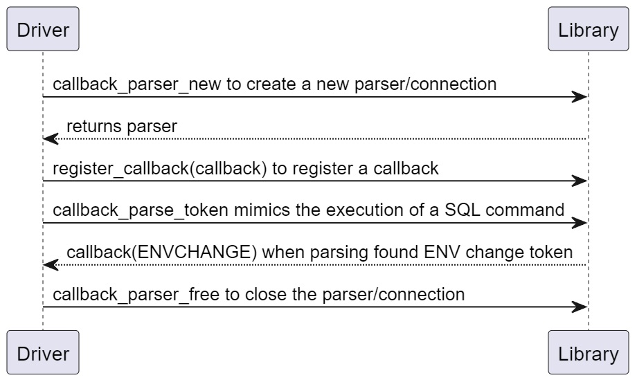
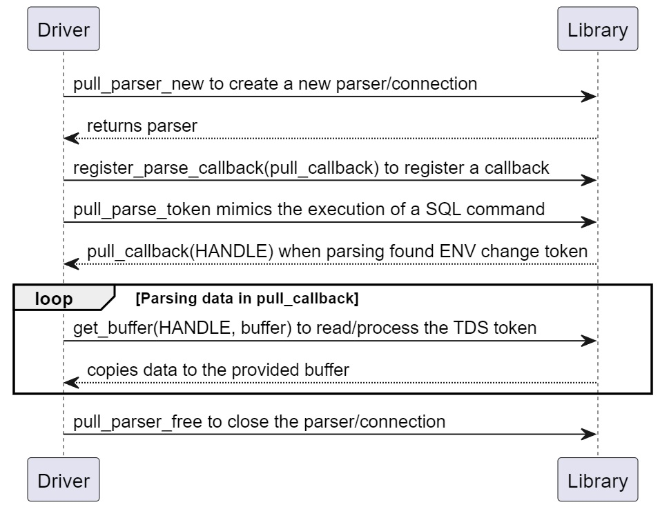
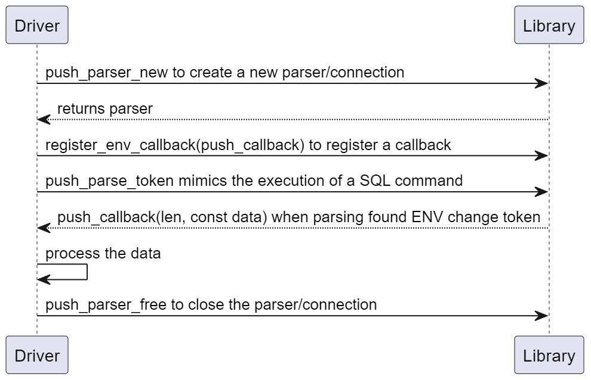

# ffi-prototype

This project aims to describe potential methods for transferring data between a driver code and the Rust TDS library.
The TDS library is designed to be a shared library for various driver implementations and therefore it needs to establish a common interface.
Using the new TDS library for existing drivers like ODBC and OLE DB will be a challenge.
The implementation might need some modifications to the existing driver code that could have some risk.
The difficulties with existing drive code is documented in [TDS Rust library.docx](https://microsoft.sharepoint-df.com/:w:/t/sqldevx/EcprbQoAvwZBil7S1RImi2MBous3stuFm2ROM_ZdPhQ8zw?e=n80mY7).

The ffi-prototype code demonstrates various ways of transferring data from the TDS library (SQL) to a driver layer.
The prototype includes two projects:
1.	ffi-library project is a Rust package that produces a DLL binary. It exposes functions that are invoked from drivers.
2.	The ffi-app project produces a Windows executable binary. This code mimics a driver implant that invokes the ffi-library.

One key feature of TDS library is to read, handle and parse TDS stream. Some data from that stream are relevant for the TDS library itself but most of the data are transferred to the driver layer.
The prototype shows how to implement three solutions for passing data from TDS library to a driver. The aim is to explain and teach the method of each solution.
The final TDS library can use more than one solution, or a mix of them, instead of only one solution.

## 1.	Callback solution
There are tokens in the TDS stream that have relevant information ti the TDS library, and they may also have some importance for a driver implementation.
Here, the existing driver implementation transforms the token into a data structure and uses it in the TDS parser, as well as passing it in the driver layer.
An example can be OnEnvChange method in the current ODBC and OLE DB code.
The initial code for this solution can be found in Callback.h, Callback.cpp and callback.rs source files.
Callback.h defines C type ENVCHANGE struct that is a copy of existing code in ODBC and OLE DB drivers.
The same data structure is defined in Rust code in callback.rs in EnvChange struct.
The code flow in this solution is:

There is a parsing code in callback.rs that converts TDS stream to a data structure that can be used in both places.
The solution can be suitable for cases when TDS liberty needs to consume data from TDS token.
It is not a solution for all TDS tokens. The shared data structure should be declared for public access if the solution uses it.
They should be different from the ones in the existing driver code because they are not complete.

## 2.	Pull buffer solution
Here, the TDS library indicates there is a new token to parse and calls a driver method.
The drive method receives a pointer to TDS object that can be used to read token stream.
It is similar to what is done in the current driver code.
Where the TDS parser passes pointer to BATCHCTX and the driver calls GetBytes to process the stream.
The code flow in this solution is:

Here is a parsing code in the driver layer and it is closer to existing driver solution.
The implementation will require many FFI calls, at least one for every token piece.
The driver code allocates a memory space and invokes get_buffer method. The library transfers data to the given memory.

## 3.	Push buffer solution
Here, the TDS library passes the entire TDS token as a read only buffer to the driver.
The driver parsed pieces and copies the relevant data.
The code flow in this solution is:

The solution may have limitations for some TDS tokens, but it makes the code on the TDS library side more straightforward.
